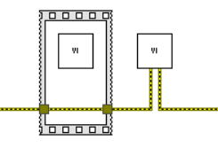
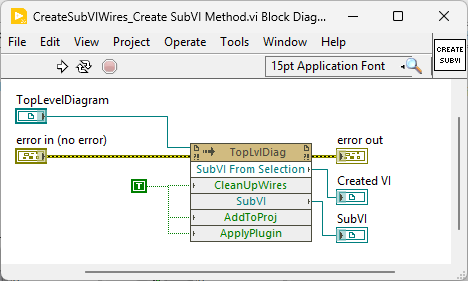
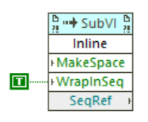
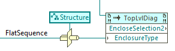
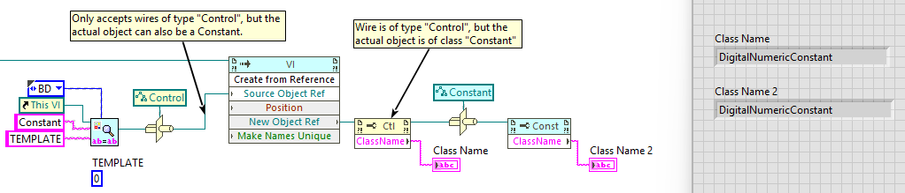
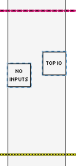
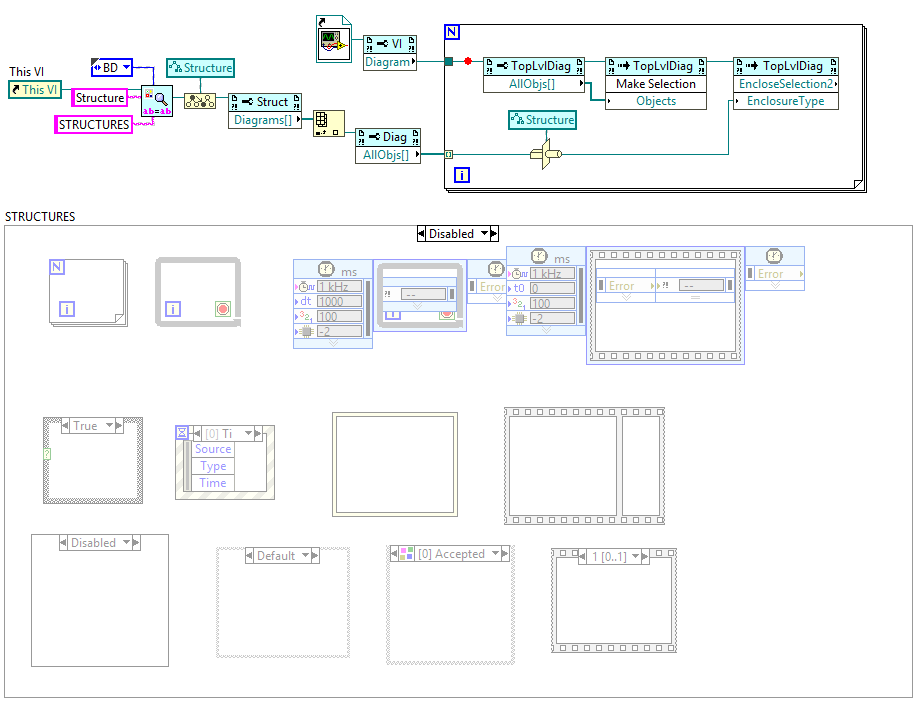
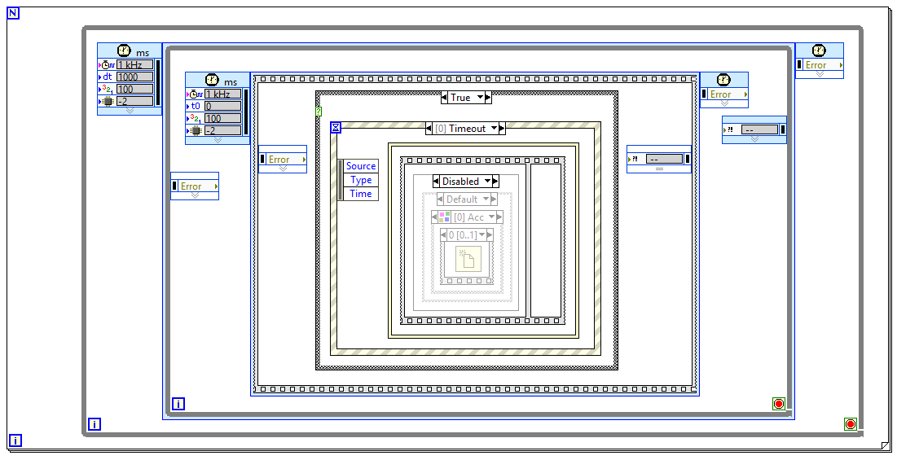

# Enclose-in-Structure

Direct and Indirect Contributors (Discord Names):
* Raph Schru
* Nathan Davis
* DNatt
* Redhawk
* Peter
* Tim Elsey

All three: Flat Sequence Structure from palettes, fss from Quick Drop, and Quick Drop Sequence do not pass a selected wire through the structure. This is probably intended since the data on the wire isn't being manipulated in the structure, hence shouldn't pass through the structure.
Nonetheless, there is value in having the wire through the structure being placed if the wire is selected.

Inspiration:
Do not pass unmodified values through a VI. It degrades readability.

On goal here is to eliminate pass through values in VIs by easily allowing developers to wrap a Flat Sequence Structure around the VI (that otherwise would pass the immutable error through it's terminal for serialization) and error wire. This operation of putting a structure around a selected wire does not pass the wire through the structure, rather only placing the structure over the wire.
Philosophically, passing real data to purposely enforce execution order is an anti pattern. The language shouldn’t allow non modified pass through values in VIs (unless they are dynamic dispatch terminals).

If the error wire is being passed through the VI only for serialization, then the VI in the calling code should have a flat sequence structure around the VI and error for serialization.


**TODO: Insert updated picture.**
*Preferred Flat Sequence Structure usage for serializing a VI with the error wire (left), opposed to passing the error wire through the VI (where the VI does not mutate the error) (right).*

Goal: RC that takes wire(s) and/or other VI(s) and passes the wire through the selected structure.


*Structure Placement.*

Process:
Insert a `Always Copy.vi`, insert the `Structure` around it, then delete `Always Copy.vi`.

## Packaging

https://forums.ni.com/t5/Quick-Drop-Enthusiasts/How-to-configure-Package-Build-Spec-for-Quick-Drops/td-p/3806926
## SubVI Idea

1. Create SubVI from selection (internals shown below)
2. Replace with SubVI contents
This would work well for a `Sequence Structure` since `WrapInSeq` is an option`SubVI:Inline`, as shown below.


*Create SubVI icon.*


*`WrapInSeq`.*

Considerations, yet to be determined: Inline the unsaved subVI, might return a save prompt.

Note the code here:
`[LabVIEW 20xx]\resource\plugins\PopupMenus\edit time panel and diagram\Create SubVI from Selected Wires.llb`

1. Inserts `Always Copy.vi` on selected wires
2. Selects the various `Always Copy.vi`
3. Makes a subVI out of them
4. Removes the various `Always Copy.vi`

Use the `TopLevelDiagram:EncloseSelection2`, noting:
1. Must wire a reference to an actual structure to specify the structure type, not just a `Class Specifier Constant`.
2. Only accepts classes that inherit from `Structure`. For a `Flat Sequence Structure` (since `Flat Sequence Structure` does not inherit from `Structure`), a workaround can be used to type cast to a `Structure` below. Otherwise, one could explicitly wrap with a `Stacked Sequence`, then convert to a `Flat Sequence Structure` via the convert method below.


*Type Cast Structure. EncloseSelection2 allows passing of a Flat Sequence directly, only requiring a `Structure` type cast.*


*Convert To FlatSeq.*

`Structure` properties `Position` and `Frame Size` allow repositioning/resizing. The downside is you can only resize from the bottom and right sides.

> Context help of private property "Frame Rectangle" claims it can resize from all sides, unfortunately it always returns error 1058 (property not found)...

Other class hierarchies such as the XML Parser classes require a `Coerce To Type` because `To More Specific` / `To More Generic` are not supported for this class hierarchy. Refer to this presentation [Everything You Need to Know about VI Scripting in LabVIEW](https://forums.ni.com/t5/Community-Documents/Everything-You-Need-to-Know-about-VI-Scripting-in-LabVIEW/ta-p/4428599), in particular:
* Flat Sequences: Slides 44-45
* Type Casting refnums: Slide 48

There are other cases where a Type Cast is needed, such as when using VI method `Create from Reference` to create a constant. Both input `Source Object Ref` and output `New Object Ref` are of type `Control`, but work with type cast'ed constants too.
Ideally, the method's terminal's type should be the common parent class (`GObject`) to avoid the need for such hacks. Image illustration below.


*Type Cast Class Name at outputs preserved.*

Note that the Type Casting isn't foolproof such as casting a `ComboBoxConstant` to `ComboBox` to try to set a property on the constant. LabVIEW subsequently crashed.

Further mention of another type cast usage example: `LabVIEWClassConstant` -> `LabVIEWClassControl` to access `LabVIEW Class Name` / `Qualified Name` properties found at
[LabVIEW: Scripting: Obtaining name of LVClass wrapped in DVR](https://forums.ni.com/t5/LabVIEW/Scripting-Obtaining-name-of-LVClass-wrapped-in-DVR/m-p/4473917).

The placements of `Always Copy.vi` are pixel perfect with the selected elements, ensuring the most compact structure is created.


This plugin can be downloaded on VIPM:
[VIPM: Enclose In Structure](https://www.vipm.io/)
**TODO: Link above has not been created**

General Resources here:
- [Quick Drop Enthusiasts](https://forums.ni.com/t5/Quick-Drop-Enthusiasts/bd-p/grp-1251)
- [Just Passing Through](https://dqmh.org/just-passing-through/)
- [Your LabVIEW Code Is a Work of Art... But I Can't Read It by Darren Nattinger. GDevCon N.A. 2024](https://www.youtube.com/watch?v=AHOZ7fiuWCA)
- [An End to Brainless Programming - Darren Nattinger](https://www.youtube.com/watch?v=pS1UBZzKl9k)
- [Quick Drop Enthusiasts: Add structure support to Insert QD shortcut](https://forums.ni.com/t5/Quick-Drop-Enthusiasts/Add-structure-support-to-Insert-QD-shortcut/m-p/4242321)
- [LabVIEW Idea Exchange: Option to connect wires through a dropped structure](https://forums.ni.com/t5/LabVIEW-Idea-Exchange/Option-to-connect-wires-through-a-dropped-structure-on-the/idi-p/1483814)
- [LabVIEW Idea Exchange: Add structure on bare wires](https://forums.ni.com/t5/LabVIEW-Idea-Exchange/Add-structure-on-bare-wires/idi-p/4467734)


---

**Place image and comment into the source code.**

Bounds of where `Always Copy.vi` are placed (respective corner of the `Always Copy.vi` match the corner of the selected elements bound. For wires (since we know the reference, we can get it's position), if the `Always Copy.vi` is beyond these bounds, then get its position and move it to within the bounds. Always placing `Always Copy.vi` at the matching corners of where the `Structure` should go.

---


---
---
---


Two Quick Drop shortcuts ("s" for `Structure`): `ctrl+s` and `ctrl+shift+s`.

QD VI Description:
```
This is merely a Quick Drop shortcut that wires across wires for a flat sequence structure
The flat sequence structure is minimally compact, independent of what is drawn.
This will surely be replaced once NI enables pass through values to propagate through structures, by default.
```


### Enclose In Structure `ctrl+s`

1. Select object(s),
2. Press `ctrl+space`,
3. Type the structure abbreviation (fss, ws, fr, etc),
4. press `ctrl+s`.
This wires the structure compactly around what has been selected.
At the end, selects the structure. This allows one to `ctrl+s` further structures around the selected structure. This enables one to create nested structures immediately.

`ctrl+s` without structure abbreviation defaults as the `Flat Sequence Structure`.

### Replace With Structure `ctrl+shift+s`

Natively LabVIEW does not allow for all structures to replace each other. There are only certain combinations that exist, such as `Flat Sequence` can be replaced with a `Stacked Sequence`, but not a `While Loop`.

1. Select structure,
2. Press `ctrl+space`,
3. Type the structure abbreviation (fss, ws, fr, etc),
4. press `ctrl+shift+s`.
This replaces the selected structure with the structure corresponding to the structure abbreviation.

Can only replace structure(s).
For one who wants to replace a non structure selection with a structure, can wrap selected elements with a structure by using `ctrl+s`, then `ctrl+r` the internal objects of the structure.
Idea :bulb:: Right click menu for selecting everything within a structure could be beneficial for the above?

At the end, selects the structure, just as `ctrl+s` does.

---


(`ctrl+s`) Given any selected wires that are identified as `Pass Through Wires`, the script will pass them through the structure depending on the `Structure`:
* Single Frame
	* **While Loop**: Shift Registers
	* **For Loop**: Shift Registers
	* **Flat Sequence**: Pass through
	* **Timed Loop**: Pass through
	* **Timed Sequence**: Pass through
	* **In Place Element**: Pass through (unless cluster or containing class will unbundle / bundle with pass through of first element)
* Multi Frame
	* **Case Structure**: Linked Input Tunnel -> Create & Wire Unwired Cases
	* **Event**: Linked Input Tunnel -> Create & Wire Unwired Cases
	* **Diagram Disable**: Linked Input Tunnel -> Create & Wire Unwired Cases
	* **Conditional Disable**: Linked Input Tunnel -> Create & Wire Unwired Cases
	* **Type Specialization**: Linked Input Tunnel -> Create & Wire Unwired Cases

Support for all relevant structures. The following structures are not included:
- Stacked Sequence
- Formula Node
- Shared Variable
- Local Variable
- Global Variable
- Decorations
- Feedback Node

All structures marked with:
- Auto Grow: False
- Exclude From Diagram Cleanup: False
Future releases could leverage a local .ini file, customizable by the user, only if loading the .ini is not too slow.


---



*Structure Type Cast.*


*Structure Type Cast Result.*


Idea :bulb:: `ctrl+shift+s` acts as a replace AND cleanup the structure.
For example, when there is a say `Case Structure` selected, `ctrl+space` and `ctrl+shift+s` (without anything in the box i.e. "") would detect the structure type, realize it doesn't need to replace it is "" in the combo box, and perform a cleanup to the diagram. This could occur by:
1. Programmatically selecting the internals of the case structure
	1. If it is a multiframe structure, as is here, iterate through each frame and find the bounds of the internally selected objects to determine the largest bounds for all frames , then make a new case structure within.
2. If the structure can resize to the bounds specified, then just make it smaller in that capacity.
   *Note the resizing trickery elsewhere in the doc.*


Idea :bulb:: FSS madness: some kind of right click for the FSS, where, depending on where the right click occurs, takes the preexisting FSS and made a cascade FSS, effectively making another frame by separating the sides.