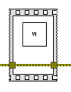
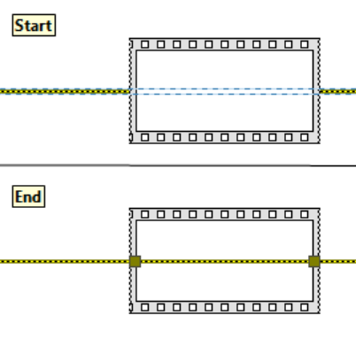
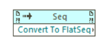
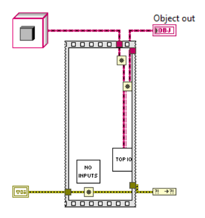

Direct and Indirect Contributors:
* Raph Schru
* Nathan Davis
* Peter
* Tim Elsey
* Redhawk
* DNatt

All three: Flat Sequence Structure from palettes, fss from Quick Drop, and Quick Drop Sequence do not pass a selected wire through the structure. This is probably intended since the data on the wire isn't being manipulated in the structure, hence shouldn't pass through the structure.
Nonetheless, there is value in having the wire through the structure being placed if the wire is selected.

Inspiration:
Do not pass unmodified values through a VI. It degrades readability.

On goal here is to eliminate pass through values in VIs by easily allowing developers to wrap a Flat Sequence Structure around the VI (that otherwise would pass the immutable error through it's terminal for serialization) and error wire. This operation of putting a structure around a selected wire does not pass the wire through the structure, rather only placing the structure over the wire.
Philosophically, passing real data to purposely enforce execution order is an anti pattern. The language shouldn’t allow non modified pass through values in VIs (unless they are dynamic dispatch terminals).

**TODO: Insert updated picture.**
*Preferred Flat Sequence Structure usage for serializing a VI with the error wire (left), opposed to passing the error wire through the VI (where the VI does not mutate the error) (right).*

Goal: RC that takes wire(s) and/or other VI(s) and passes the wire through the selected structure.

*Structure Placement.*

Process:
Insert a `Always Copy.vi`, insert the `Structure` around it, then delete `Always Copy.vi`.

## SubVI Idea

1. Create SubVI from selection (internals shown below)
2. Replace with SubVI contents
This would work well for a `Sequence Structure` since `WrapInSeq` is an option`SubVI:Inline`, as shown below.

*Create SubVI icon.*

*`WrapInSeq`.*

Considerations, yet to be determined: Inline the unsaved subVI, might return a save prompt.

Note the code here:
`[LabVIEW 20xx]\resource\plugins\PopupMenus\edit time panel and diagram\Create SubVI from Selected Wires.llb`

1. Inserts `Always Copy.vi` on selected wires
2. Selects the various `Always Copy.vi`
3. Makes a subVI out of them
4. Removes the various `Always Copy.vi`

Use the `TopLevelDiagram:EncloseSelection2`, noting:
1. Must wire a reference to an actual structure to specify the structure type, not just a `Class Specifier Constant`.
2. Only accepts classes that inherit from `Structure`. For a `Flat Sequence Structure` (since `Flat Sequence Structure` does not inherit from `Structure`), a workaround can be used to type cast to a `Sequence`. Otherwise, one could explicitly wrap with a `Stacked Sequence`, then convert to a `Flat Sequence Structure` via the convert method below.

*Convert To FlatSeq.*

**Created branch**

Discussions here:
- [Just Passing Through](https://dqmh.org/just-passing-through/)
- [Your LabVIEW Code Is a Work of Art... But I Can't Read It by Darren Nattinger. GDevCon N.A. 2024](https://www.youtube.com/watch?v=AHOZ7fiuWCA)
- [An End to Brainless Programming - Darren Nattinger](https://www.youtube.com/watch?v=pS1UBZzKl9k)
- [Quick Drop Enthusiasts: Add structure support to Insert QD shortcut](https://forums.ni.com/t5/Quick-Drop-Enthusiasts/Add-structure-support-to-Insert-QD-shortcut/m-p/4242321)
- [LabVIEW Idea Exchange: Option to connect wires through a dropped structure](https://forums.ni.com/t5/LabVIEW-Idea-Exchange/Option-to-connect-wires-through-a-dropped-structure-on-the/idi-p/1483814)
- [LabVIEW Idea Exchange: Add structure on bare wires](https://forums.ni.com/t5/LabVIEW-Idea-Exchange/Add-structure-on-bare-wires/idi-p/4467734)

*Bounds of where Always Copy can be placed. If the Always Copy is beyond these bounds, then get its position, delete it, and insert position that is within bounds by adjusting the positions that are out of bounds by using the **Insert Point** input on **Wire:Insert Node**. Also for **Alway Copy** within structure, prevents this below.*

*Prevent this action by always placing at the vertices of where the fss should go on the **first** fss placement (which will be deleted later in script).*

This tool places a structure around selected *elements* and ensures all wires selected are wired through the structure as well. Different structures have different rules (while loop are shift registers, case structures are pass through **(what's the name of this?)**, etc.)

